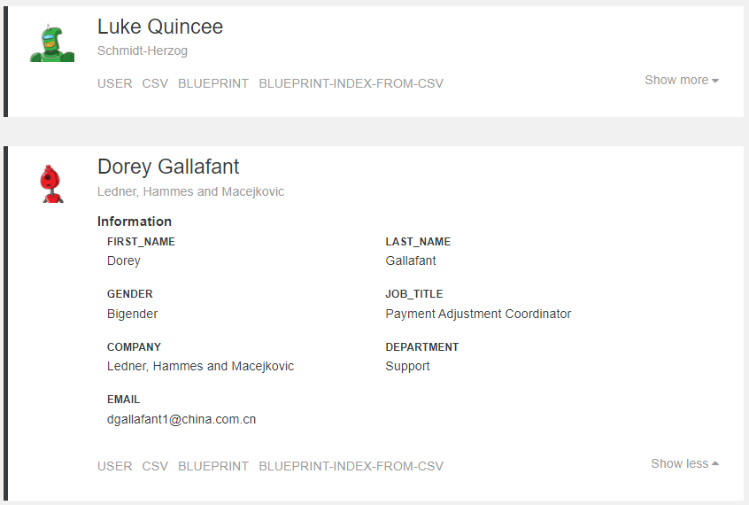

# Onify Blueprint: Index objects from CSV-file

Read a CSV file using PowerShell and transforms and bulk index data into Onify. Onify can read and index data from any data source, CSV is just one of many formats. When indexed, create a workspace to show the results.

## Requirements

* Onify Hub v2
* Onify Agent (tagged `agent` and running Windows)
* Onify Flow license
* Camunda Modeler 4.4 or later 

## Included

* 1 x Flows
* 1 x PowerShell script (agent based)
* 1 x CSV example file

## Setup

* Copy `FakeUsers.csv` to `c:\temp`
* Copy `ReadCSV.ps1` to Onify Agent scripts folder (eg. `.\scripts`)  

## Run 

1. Open `*.bpmn` in Camunda Modeler
2. Click `Start current diagram`

## Support

* Community/forum: https://support.onify.co/discuss
* Documentation: https://support.onify.co/docs
* Support and SLA: https://support.onify.co/docs/get-support

## License

This project is licensed under the MIT License - see the [LICENSE](LICENSE) file for details.
